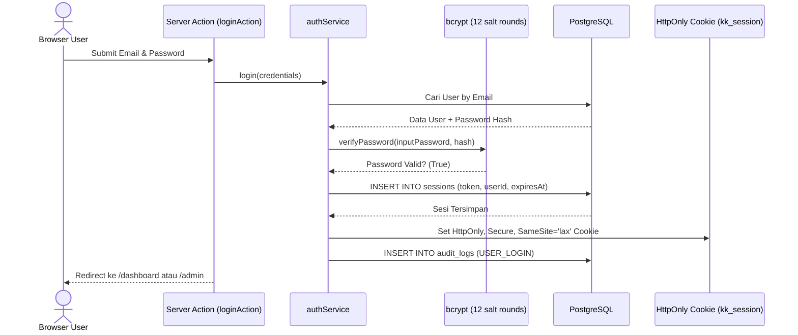
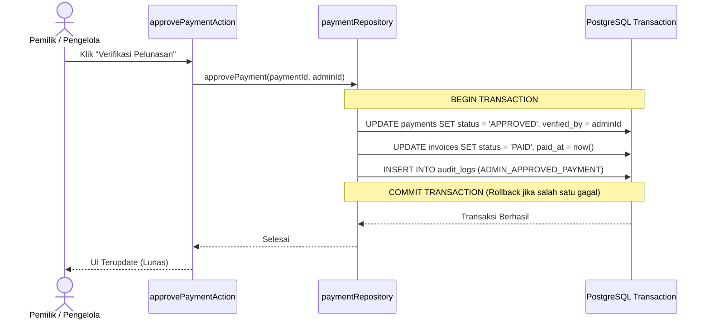

# Arsitektur Aplikasi Next.js & Sistem Autentikasi / Otorisasi
## Sistem Manajemen Kontrakan

Dokumen ini mendokumentasikan arsitektur folder Next.js (App Router), implementasi authentication (session-based), dan authorization (RBAC & Object-Level) yang dibangun berdasarkan [PRD.md](file:///C:/Semuaprojek/projectNextJS/kelola-kontrakan/PRD.md).

---

## 1. Struktur Folder Next.js (App Router)

Sesuai dengan ketentuan pada **PRD Bagian 46 & 47**, aplikasi menerapkan prinsip **Separation of Concerns** yang memisahkan lapisan UI, Server Actions, Services, Repositories, dan Database:

```text
kelola-kontrakan/
├── prisma/
│   ├── schema.prisma             # Skema data relasional PostgreSQL lengkap
│   └── seed.ts                   # Skrip seeder awal (Admin, Penyewa, Unit, Tagihan)
├── src/
│   ├── app/                      # Next.js App Router
│   │   ├── (public)/             # Halaman publik (tanpa login)
│   │   │   ├── page.tsx          # Beranda / Landing page publik (PRD Sec 6)
│   │   │   └── kontrakan/
│   │   │       ├── page.tsx      # Katalog daftar kontrakan (PRD Sec 7)
│   │   │       └── [slug]/
│   │   │           └── page.tsx  # Detail kontrakan & ketersediaan kamar (PRD Sec 8)
│   │   │
│   │   ├── (auth)/               # Halaman autentikasi
│   │   │   └── login/
│   │   │       ├── page.tsx      # Form login admin & penyewa
│   │   │       └── actions.ts    # Server Actions: loginAction, logoutAction
│   │   │
│   │   ├── dashboard/            # Portal Penyewa / User (PRD Sec 25)
│   │   │   ├── layout.tsx        # Layout penyewa dengan guard requireAuth()
│   │   │   ├── page.tsx          # Dashboard ringkasan tagihan & unit
│   │   │   ├── kontrakan-saya/   # Detail unit yang ditempati (PRD Sec 26)
│   │   │   ├── tagihan/          # Daftar tagihan invoice bulanan
│   │   │   ├── pembayaran/       # Form upload bukti transfer manual (PRD Sec 20)
│   │   │   │   ├── page.tsx
│   │   │   │   ├── actions.ts    # Server Action: submitPaymentAction
│   │   │   │   └── payment-form.tsx
│   │   │   ├── riwayat/          # Riwayat histori pembayaran (PRD Sec 27)
│   │   │   └── profil/           # Informasi akun penyewa
│   │   │
│   │   └── admin/                # Portal Pemilik / Pengelola Kontrakan (PRD Sec 9)
│   │       ├── layout.tsx        # Layout admin dengan guard requireAdmin()
│   │       ├── page.tsx          # Dashboard ringkasan statistik operasional
│   │       ├── kontrakan/        # CRUD Properti Kontrakan (PRD Sec 10)
│   │       ├── unit/             # Manajemen Unit & Kamar (PRD Sec 11)
│   │       ├── penyewa/          # Manajemen Penyewa (PRD Sec 12)
│   │       ├── tagihan/          # Pengelolaan Tagihan Bulanan (PRD Sec 15)
│   │       ├── pembayaran/       # Antrean Verifikasi Pembayaran (PRD Sec 22 & 53)
│   │       │   ├── page.tsx
│   │       │   ├── actions.ts    # Server Actions: approvePaymentAction, rejectPaymentAction
│   │       │   └── verification-card.tsx
│   │       ├── pengaturan/       # Pengaturan Rekening Bank Penerima (PRD Sec 39)
│   │       └── audit-log/        # Log Jejak Audit Sistem (PRD Sec 41 & 73)
│   │
│   ├── proxy.ts                  # Next.js 16 Proxy: Optimistic route protection & redirects
│   │
│   ├── lib/                      # Infrastruktur & Utilitas
│   │   ├── prisma.ts             # Prisma Client Singleton
│   │   ├── password.ts           # Hashing & verifikasi password bcrypt (12 rounds)
│   │   ├── session.ts            # Sesi database & JWT cookie (HttpOnly, SameSite)
│   │   ├── auth.ts               # Guard: getCurrentUser, requireAuth, requireAdmin, assertCanAccess
│   │   ├── utils.ts              # Format Rupiah (IDR), tanggal Indonesia, Tailwind clsx
│   │   └── validations/          # Skema validasi Zod
│   │       ├── auth.ts           # Schema login & registrasi
│   │       └── payment.ts        # Schema submit pembayaran & verifikasi
│   │
│   ├── repositories/             # Lapisan Akses Data (Data Access Layer)
│   │   ├── user.repository.ts
│   │   └── payment.repository.ts # Eksekusi transaksi atomik (Prisma $transaction)
│   │
│   ├── services/                 # Lapisan Logika Bisnis (Business Logic)
│   │   └── auth.service.ts
│   │
│   └── types/                    # Definisi Tipe TypeScript
│       ├── auth.ts
│       └── index.ts
│
├── .env                          # Kredensial Database & Auth Secret (diabaikan git)
├── .env.example                  # Template dokumentasi variabel environment
├── DATABASE_ERD.md               # Dokumentasi Diagram ERD & Kamus Data
└── PRD.md                        # Dokumen Persyaratan Produk Sumber
```

---

## 2. Alur Autentikasi (Authentication Flow)

Aplikasi mengimplementasikan **Secure Database Session-Based Authentication** sesuai rekomendasi Next.js dan **PRD Bagian 28**:



### Karakteristik Keamanan Autentikasi:
1. **Password Hashing Modern:** Password di-hash menggunakan algoritma `bcrypt` dengan cost factor 12 rounds (PRD Sec 28 & 43.6). Password plaintext tidak pernah disimpan atau dikembalikan ke antarmuka client.
2. **Session Tersimpan di Database:** Sesi aktif dicatat pada tabel `sessions` di PostgreSQL, memungkinkan admin atau pengguna mencabut sesi kapan saja (invalidation).
3. **Cookie Bertaraf Keamanan Tinggi:**
   - `HttpOnly: true` (mencegah pencurian token melalui script XSS di browser).
   - `Secure: true` pada environment production (hanya dikirim melalui HTTPS).
   - `SameSite: 'lax'` (mencegah serangan CSRF).
   - `Max-Age: 7 hari` dengan mekanisme kadaluarsa otomatis.

---

## 3. Sistem Otorisasi (Authorization System)

Sesuai ketentuan pada **PRD Bagian 29, 30, dan 31**, autentikasi dipisahkan secara tegas dari otorisasi. Otorisasi dilakukan di dua lapisan:

### 3.1 Lapisan 1: Role-Based Access Control (RBAC)
* **Proxy Next.js 16 (`src/proxy.ts`):**
  - Mencegah akses anonim ke rute `/admin/*` dan `/dashboard/*` (redirect ke `/login?callbackUrl=...`).
  - Mencegah pengguna non-admin (`role = USER`) membuka rute `/admin/*` (otomatis diarahkan ke `/dashboard`).
  - Mengarahkan pengguna yang sudah terotentikasi menjauhi halaman `/login` langsung ke portal masing-masing.
* **Server-Side Enforcement (`requireAdmin()` & `requireAuth()` di `src/lib/auth.ts`):**
  - Otorisasi dijalankan di level server pada Server Components dan Server Actions.
  - Tidak hanya menyembunyikan navigasi di antarmuka frontend, namun langsung memblokir eksekusi request ilegal di backend.

### 3.2 Lapisan 2: Object-Level Authorization (Pencegahan IDOR)
Berdasarkan **PRD Bagian 31**, pengguna tidak boleh mengakses resource milik pengguna lain meskipun mengetahui ID-nya:
* `assertCanAccessRental(user, rentalId)`: Memvalidasi bahwa data kontrak sewa terkait benar-benar milik user yang sedang login atau actor adalah ADMIN.
* `assertCanAccessInvoice(user, invoiceId)`: Memvalidasi kepemilikan tagihan sebelum penyewa diizinkan melihat atau membayar tagihan tersebut.
* `assertCanAccessPayment(user, paymentId)`: Memvalidasi kepemilikan bukti pembayaran dan mencegah manipulasi status pembayaran dari browser.

---

## 4. Alur Transaksi Pembayaran Atomik (Atomic Verification Workflow)

Berdasarkan **PRD Bagian 23 & 70**, proses persetujuan verifikasi transfer wajib menggunakan transaksi database PostgreSQL (`prisma.$transaction`) agar tidak terjadi kondisi inkonsisten:



---

## 5. Akun Uji Coba (Seeded Test Accounts)

Database live telah diisi dengan data awal yang siap digunakan untuk pengujian:

| Role | Nama | Email | Kata Sandi | Halaman Utama |
| :--- | :--- | :--- | :--- | :--- |
| **ADMIN** | Ibu Hj. Aminah (Pemilik) | `admin@kontrakan.com` | `Admin123!` | `/admin` |
| **USER** | Budi Santoso (Penyewa Unit A-01) | `budi@gmail.com` | `Tenant123!` | `/dashboard` |
| **USER** | Siti Rahma (Penyewa Unit A-02) | `siti@gmail.com` | `Tenant123!` | `/dashboard` |
