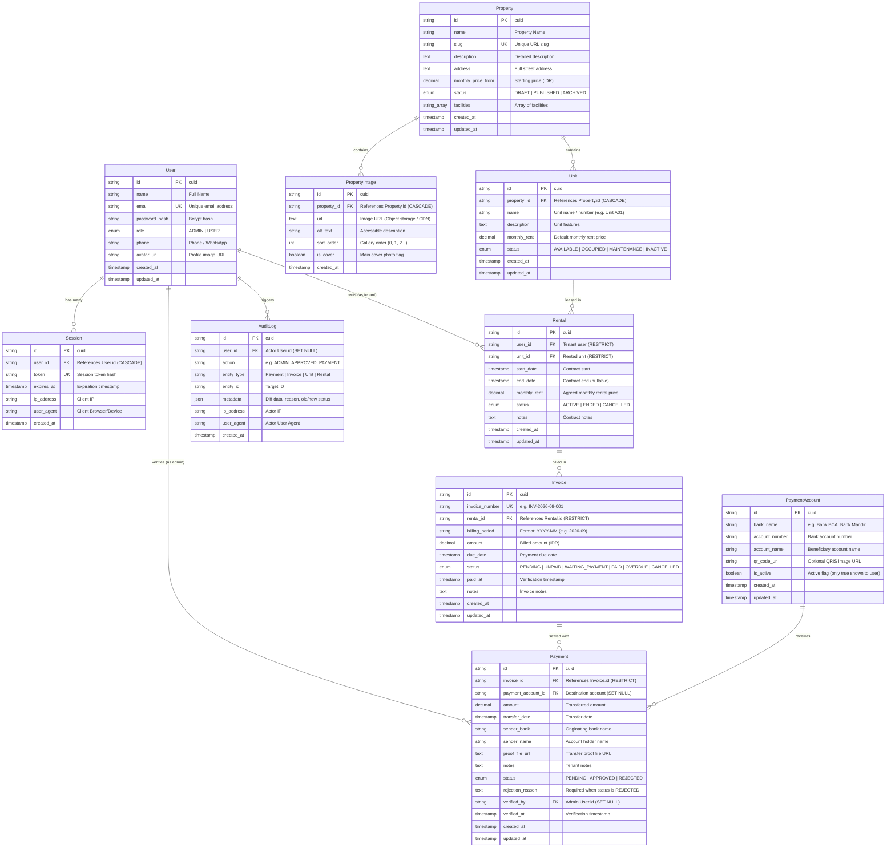

# Database Schema & Entity Relationship Diagram (ERD)
## Sistem Manajemen Kontrakan

Dokumen ini mendokumentasikan skema database relasional lengkap untuk **Sistem Manajemen Kontrakan** yang dibangun di atas PostgreSQL menggunakan Prisma ORM sesuai dengan ketentuan pada [PRD.md](file:///C:/Semuaprojek/projectNextJS/kelola-kontrakan/PRD.md).

---

## 1. Entity Relationship Diagram (ERD)



---

## 2. Tabel & Relasi Detail

### 2.1 `users`
Menyimpan kredensial dan identitas pemilik kos/kontrakan (`ADMIN`) dan penyewa (`USER`).
* **Primary Key:** `id` (cuid string)
* **Unique Constraints:** `email`
* **Indexes:** `idx_users_email`, `idx_users_role`
* **Relasi:**
  - 1-N ke `sessions` (onDelete: Cascade)
  - 1-N ke `rentals` (onDelete: Restrict — user yang memiliki riwayat sewa tidak boleh langsung dihapus fisik)
  - 1-N ke `payments` via `verified_by` (onDelete: Set Null)
  - 1-N ke `audit_logs` (onDelete: Set Null)

### 2.2 `sessions`
Mendukung *Secure session-based authentication* (PRD Bagian 28). Token acak terenkripsi disimpan dalam database dan dicocokkan dengan session cookie HttpOnly.
* **Primary Key:** `id`
* **Unique Constraints:** `token`
* **Indexes:** `idx_sessions_token`, `idx_sessions_user_id`, `idx_sessions_expires_at`
* **Relasi:** N-1 ke `users` (onDelete: Cascade)

### 2.3 `properties`
Data induk kontrakan/kompleks properti yang dapat memiliki banyak unit/kamar di dalamnya.
* **Primary Key:** `id`
* **Unique Constraints:** `slug` (digunakan untuk SEO-friendly URL: `/kontrakan/[slug]`)
* **Indexes:** `idx_properties_slug`, `idx_properties_status`
* **Status Enum:**
  - `DRAFT`: Belum dipublikasikan, hanya terlihat oleh admin.
  - `PUBLISHED`: Tampil pada katalog publik (`/kontrakan`).
  - `ARCHIVED`: Diarsipkan, tidak tampil di publik namun data histori tetap terjaga.

### 2.4 `property_images`
Galeri foto properti untuk landing page publik dan detail properti.
* **Primary Key:** `id`
* **Indexes:** `idx_property_images_property_id`
* **Relasi:** N-1 ke `properties` (onDelete: Cascade)

### 2.5 `units`
Unit atau kamar spesifik dalam kontrakan (misal: Unit A01, Kamar 3).
* **Primary Key:** `id`
* **Indexes:** `idx_units_property_id`, `idx_units_status`
* **Status Enum:** `AVAILABLE`, `OCCUPIED`, `MAINTENANCE`, `INACTIVE`
* **Relasi:**
  - N-1 ke `properties` (onDelete: Cascade)
  - 1-N ke `rentals` (onDelete: Restrict)

### 2.6 `rentals`
Menghubungkan penyewa (`User`) dengan `Unit` kontrakan.
* **Primary Key:** `id`
* **Indexes:** `idx_rentals_user_id`, `idx_rentals_unit_id`, `idx_rentals_status`
* **Status Enum:** `ACTIVE`, `ENDED`, `CANCELLED`
* **Business Rule 1 (PRD Sec 60):** Satu unit hanya boleh memiliki maksimal 1 kontrak `ACTIVE`. Ketika rental `ACTIVE`, status unit menjadi `OCCUPIED`.

### 2.7 `invoices`
Tagihan sewa bulanan yang diterbitkan untuk setiap kontrak sewa.
* **Primary Key:** `id`
* **Unique Constraints:** `UNIQUE(rental_id, billing_period)` **(Krusial: PRD Sec 17 & 37)**
  - Mencegah timbulnya duplicate invoice untuk unit/sewa yang sama pada periode bulan yang sama.
* **Indexes:** `idx_invoices_rental_id`, `idx_invoices_billing_period`, `idx_invoices_status`, `idx_invoices_due_date`
* **Status Enum:** `PENDING`, `UNPAID`, `WAITING_PAYMENT`, `PAID`, `OVERDUE`, `CANCELLED`
* **Relasi:**
  - N-1 ke `rentals` (onDelete: Restrict)
  - 1-N ke `payments` (onDelete: Restrict)

### 2.8 `payment_accounts`
Daftar rekening bank penerima transfer manual milik admin (misal: BCA, Mandiri).
* **Primary Key:** `id`
* **Field `is_active`:** Penyewa hanya dapat melihat rekening yang berstatus `is_active = true`.

### 2.9 `payments`
Pengajuan bukti transfer manual dari penyewa untuk suatu tagihan (invoice).
* **Primary Key:** `id`
* **Indexes:** `idx_payments_invoice_id`, `idx_payments_status`, `idx_payments_transfer_date`
* **Status Enum:** `PENDING`, `APPROVED`, `REJECTED`
* **Atomic Transaction Rule (PRD Sec 23 & 70):**
  - Saat admin menekan **Approve**, sistem mengeksekusi PostgreSQL transaction:
    1. `Payment.status = APPROVED`
    2. `Invoice.status = PAID`
    3. `Invoice.paid_at = now()`
    4. Catat `AuditLog`
  - Jika salah satu gagal, seluruh transaksi di-**ROLLBACK**.
  - Saat **Reject**, alasan (`rejection_reason`) wajib diisi dan status invoice tetap `UNPAID`/`OVERDUE`.

### 2.10 `audit_logs`
Pencatatan jejak audit yang tidak dapat diubah (append-only) untuk setiap aksi krusial sistem (PRD Sec 41 & 73).
* **Primary Key:** `id`
* **Indexes:** `idx_audit_logs_user_id`, `idx_audit_logs_entity`, `idx_audit_logs_action`, `idx_audit_logs_created_at`
* **Action Types:** `ADMIN_APPROVED_PAYMENT`, `PAYMENT_REJECTED`, `INVOICE_CREATED`, `UNIT_STATUS_CHANGED`, `TENANT_ASSIGNED`, dll.

---

## 3. Skrip SQL DDL (PostgreSQL Native Reference)

```sql
-- Create ENUMS
CREATE TYPE "UserRole" AS ENUM ('ADMIN', 'USER');
CREATE TYPE "PropertyStatus" AS ENUM ('DRAFT', 'PUBLISHED', 'ARCHIVED');
CREATE TYPE "UnitStatus" AS ENUM ('AVAILABLE', 'OCCUPIED', 'MAINTENANCE', 'INACTIVE');
CREATE TYPE "RentalStatus" AS ENUM ('ACTIVE', 'ENDED', 'CANCELLED');
CREATE TYPE "InvoiceStatus" AS ENUM ('PENDING', 'UNPAID', 'WAITING_PAYMENT', 'PAID', 'OVERDUE', 'CANCELLED');
CREATE TYPE "PaymentStatus" AS ENUM ('PENDING', 'APPROVED', 'REJECTED');

-- Table: users
CREATE TABLE "users" (
    "id" TEXT NOT NULL PRIMARY KEY,
    "name" TEXT NOT NULL,
    "email" TEXT NOT NULL UNIQUE,
    "password_hash" TEXT NOT NULL,
    "role" "UserRole" NOT NULL DEFAULT 'USER',
    "phone" TEXT,
    "avatar_url" TEXT,
    "created_at" TIMESTAMP(3) NOT NULL DEFAULT CURRENT_TIMESTAMP,
    "updated_at" TIMESTAMP(3) NOT NULL
);
CREATE INDEX "users_email_idx" ON "users"("email");
CREATE INDEX "users_role_idx" ON "users"("role");

-- Table: sessions
CREATE TABLE "sessions" (
    "id" TEXT NOT NULL PRIMARY KEY,
    "user_id" TEXT NOT NULL REFERENCES "users"("id") ON DELETE CASCADE,
    "token" TEXT NOT NULL UNIQUE,
    "expires_at" TIMESTAMP(3) NOT NULL,
    "ip_address" TEXT,
    "user_agent" TEXT,
    "created_at" TIMESTAMP(3) NOT NULL DEFAULT CURRENT_TIMESTAMP
);
CREATE INDEX "sessions_token_idx" ON "sessions"("token");
CREATE INDEX "sessions_user_id_idx" ON "sessions"("user_id");
CREATE INDEX "sessions_expires_at_idx" ON "sessions"("expires_at");

-- Table: properties
CREATE TABLE "properties" (
    "id" TEXT NOT NULL PRIMARY KEY,
    "name" TEXT NOT NULL,
    "slug" TEXT NOT NULL UNIQUE,
    "description" TEXT,
    "address" TEXT NOT NULL,
    "monthly_price_from" DECIMAL(12,2) NOT NULL,
    "status" "PropertyStatus" NOT NULL DEFAULT 'DRAFT',
    "facilities" TEXT[] NOT NULL DEFAULT '{}',
    "created_at" TIMESTAMP(3) NOT NULL DEFAULT CURRENT_TIMESTAMP,
    "updated_at" TIMESTAMP(3) NOT NULL
);
CREATE INDEX "properties_slug_idx" ON "properties"("slug");
CREATE INDEX "properties_status_idx" ON "properties"("status");

-- Table: property_images
CREATE TABLE "property_images" (
    "id" TEXT NOT NULL PRIMARY KEY,
    "property_id" TEXT NOT NULL REFERENCES "properties"("id") ON DELETE CASCADE,
    "url" TEXT NOT NULL,
    "alt_text" TEXT,
    "sort_order" INTEGER NOT NULL DEFAULT 0,
    "is_cover" BOOLEAN NOT NULL DEFAULT false,
    "created_at" TIMESTAMP(3) NOT NULL DEFAULT CURRENT_TIMESTAMP
);
CREATE INDEX "property_images_property_id_idx" ON "property_images"("property_id");

-- Table: units
CREATE TABLE "units" (
    "id" TEXT NOT NULL PRIMARY KEY,
    "property_id" TEXT NOT NULL REFERENCES "properties"("id") ON DELETE CASCADE,
    "name" TEXT NOT NULL,
    "description" TEXT,
    "monthly_rent" DECIMAL(12,2) NOT NULL,
    "status" "UnitStatus" NOT NULL DEFAULT 'AVAILABLE',
    "created_at" TIMESTAMP(3) NOT NULL DEFAULT CURRENT_TIMESTAMP,
    "updated_at" TIMESTAMP(3) NOT NULL
);
CREATE INDEX "units_property_id_idx" ON "units"("property_id");
CREATE INDEX "units_status_idx" ON "units"("status");

-- Table: rentals
CREATE TABLE "rentals" (
    "id" TEXT NOT NULL PRIMARY KEY,
    "user_id" TEXT NOT NULL REFERENCES "users"("id") ON DELETE RESTRICT,
    "unit_id" TEXT NOT NULL REFERENCES "units"("id") ON DELETE RESTRICT,
    "start_date" TIMESTAMP(3) NOT NULL,
    "end_date" TIMESTAMP(3),
    "monthly_rent" DECIMAL(12,2) NOT NULL,
    "status" "RentalStatus" NOT NULL DEFAULT 'ACTIVE',
    "notes" TEXT,
    "created_at" TIMESTAMP(3) NOT NULL DEFAULT CURRENT_TIMESTAMP,
    "updated_at" TIMESTAMP(3) NOT NULL
);
CREATE INDEX "rentals_user_id_idx" ON "rentals"("user_id");
CREATE INDEX "rentals_unit_id_idx" ON "rentals"("unit_id");
CREATE INDEX "rentals_status_idx" ON "rentals"("status");

-- Table: invoices
CREATE TABLE "invoices" (
    "id" TEXT NOT NULL PRIMARY KEY,
    "invoice_number" TEXT NOT NULL UNIQUE,
    "rental_id" TEXT NOT NULL REFERENCES "rentals"("id") ON DELETE RESTRICT,
    "billing_period" TEXT NOT NULL,
    "amount" DECIMAL(12,2) NOT NULL,
    "due_date" TIMESTAMP(3) NOT NULL,
    "status" "InvoiceStatus" NOT NULL DEFAULT 'UNPAID',
    "paid_at" TIMESTAMP(3),
    "notes" TEXT,
    "created_at" TIMESTAMP(3) NOT NULL DEFAULT CURRENT_TIMESTAMP,
    "updated_at" TIMESTAMP(3) NOT NULL,
    CONSTRAINT "rental_billing_period_unique" UNIQUE ("rental_id", "billing_period")
);
CREATE INDEX "invoices_rental_id_idx" ON "invoices"("rental_id");
CREATE INDEX "invoices_billing_period_idx" ON "invoices"("billing_period");
CREATE INDEX "invoices_status_idx" ON "invoices"("status");
CREATE INDEX "invoices_due_date_idx" ON "invoices"("due_date");

-- Table: payment_accounts
CREATE TABLE "payment_accounts" (
    "id" TEXT NOT NULL PRIMARY KEY,
    "bank_name" TEXT NOT NULL,
    "account_number" TEXT NOT NULL,
    "account_name" TEXT NOT NULL,
    "qr_code_url" TEXT,
    "is_active" BOOLEAN NOT NULL DEFAULT true,
    "created_at" TIMESTAMP(3) NOT NULL DEFAULT CURRENT_TIMESTAMP,
    "updated_at" TIMESTAMP(3) NOT NULL
);

-- Table: payments
CREATE TABLE "payments" (
    "id" TEXT NOT NULL PRIMARY KEY,
    "invoice_id" TEXT NOT NULL REFERENCES "invoices"("id") ON DELETE RESTRICT,
    "payment_account_id" TEXT REFERENCES "payment_accounts"("id") ON DELETE SET NULL,
    "amount" DECIMAL(12,2) NOT NULL,
    "transfer_date" TIMESTAMP(3) NOT NULL,
    "sender_bank" TEXT NOT NULL,
    "sender_name" TEXT NOT NULL,
    "proof_file_url" TEXT NOT NULL,
    "notes" TEXT,
    "status" "PaymentStatus" NOT NULL DEFAULT 'PENDING',
    "rejection_reason" TEXT,
    "verified_by" TEXT REFERENCES "users"("id") ON DELETE SET NULL,
    "verified_at" TIMESTAMP(3),
    "created_at" TIMESTAMP(3) NOT NULL DEFAULT CURRENT_TIMESTAMP,
    "updated_at" TIMESTAMP(3) NOT NULL
);
CREATE INDEX "payments_invoice_id_idx" ON "payments"("invoice_id");
CREATE INDEX "payments_status_idx" ON "payments"("status");
CREATE INDEX "payments_transfer_date_idx" ON "payments"("transfer_date");

-- Table: audit_logs
CREATE TABLE "audit_logs" (
    "id" TEXT NOT NULL PRIMARY KEY,
    "user_id" TEXT REFERENCES "users"("id") ON DELETE SET NULL,
    "action" TEXT NOT NULL,
    "entity_type" TEXT NOT NULL,
    "entity_id" TEXT NOT NULL,
    "metadata" JSONB,
    "ip_address" TEXT,
    "user_agent" TEXT,
    "created_at" TIMESTAMP(3) NOT NULL DEFAULT CURRENT_TIMESTAMP
);
CREATE INDEX "audit_logs_user_id_idx" ON "audit_logs"("user_id");
CREATE INDEX "audit_logs_entity_type_entity_id_idx" ON "audit_logs"("entity_type", "entity_id");
CREATE INDEX "audit_logs_action_idx" ON "audit_logs"("action");
CREATE INDEX "audit_logs_created_at_idx" ON "audit_logs"("created_at");
```
